**Work-In-Progress**

# Alveo U25 FPGA Setup and Usage Notes

These notes were moved from [`github.com/mwrnd/notes/Alveo_U25`](https://github.com/mwrnd/notes/tree/8efe9930abd3d7bd873c2af624ba376467338c77/Alveo_U25).

Currently focused on trying to [debug a faulty Alveo U25](debug_log.md).

The [Alveo U25](https://www.xilinx.com/content/dam/xilinx/publications/product-briefs/alveo-u25-product-brief.pdf) is based on the [XCU25](https://en.wikipedia.org/w/index.php?title=List_of_Xilinx_FPGAs&oldid=1129244401)==[XCZU19EG-FFVC1760](https://www.xilinx.com/products/silicon-devices/soc/zynq-ultrascale-mpsoc.html#eg).

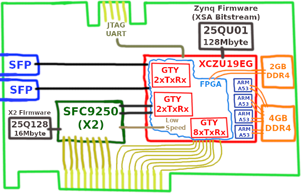

I use a [PCIe x16-to-x8 Debifurcator](https://github.com/mwrnd/PCIe_x16-to-x8_Debifurcator) to allow the board to work in systems that do not support [PCIe Bifurcation](https://www.startech.com/en-us/blog/what-is-pcie-bifurcation).

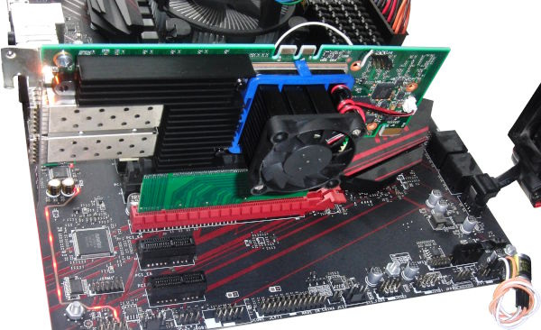


## Add Jumper to Mode1 Pin to Allow JTAG Booting

**TODO** - Is this necessary? [Why can't the Zynq be reset into JTAG Boot](https://github.com/mwrnd/alveo_u25_notes/blob/main/debug_log.md#setting-boot-mode) using JTAG commands?
```
mwr 0xff5e0200 0x0100
rst -system
```

The Mode1 Pin (AC28) is connected via a 0-ohm resistor to 1.8V to set QSPI as the Boot Mode.

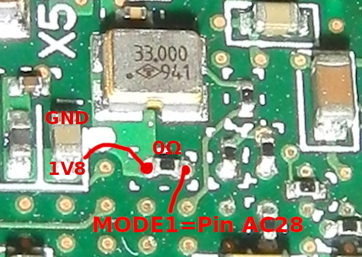

Prepare a [4-Pin 2-mm header](https://www.digikey.com/en/products/detail/adam-tech/2PH1-04-UA/9830490) by bending two pins on one end to right-angles. Also, prepare a single conductor of [0.050" 7-strand ribbon cable](https://www.digikey.com/en/products/detail/3m/3365-06-300/9478336) by exposing the strands and trimming all but one. The idea is to have a very delicate connection to the Mode1 pad so that if it gets pulled out it will not damage the PCB traces.

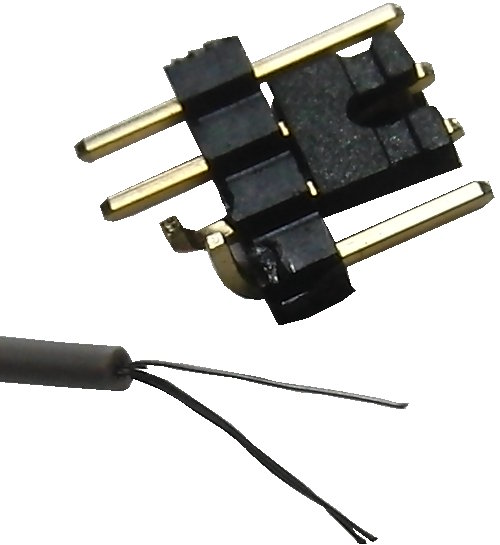

This is a very delicate modification but I managed to replace the 0201-size 0-ohm resistor with a 0402-size 10k-ohm resistor and then solder the single conductor of 0.050" 7-strand ribbon cable wire to the Mode1 side of the resistor.

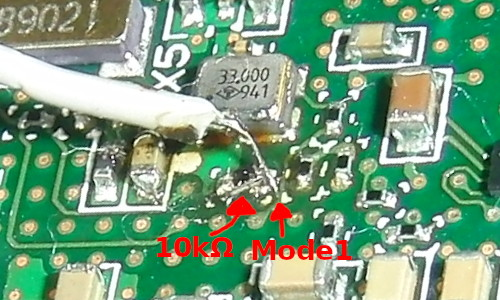

I used the J15 (NO_FLASH) jumper footprint to mount the 4-pin 2mm header. One of the J15 pads has a 10k-ohm resistor to GND. I soldered one of the header legs to the GND pad of the resistor. The other leg I soldered the Mode1 wire.

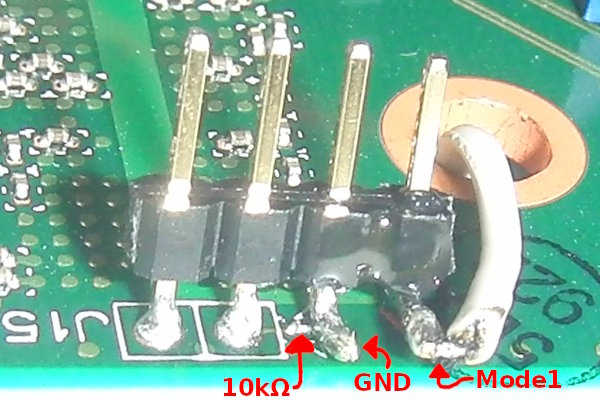

I can now short the Mode1 pin to GND using a [2mm jumper](https://www.digikey.com/en/products/detail/sullins-connector-solutions/SPN02SYBN-RC/927356) to boot the U25 in JTAG Mode which allows programming the QSPI Flash memory.

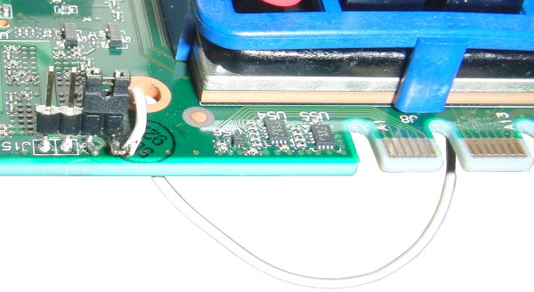

Without the jumper, QSPI boot is active.

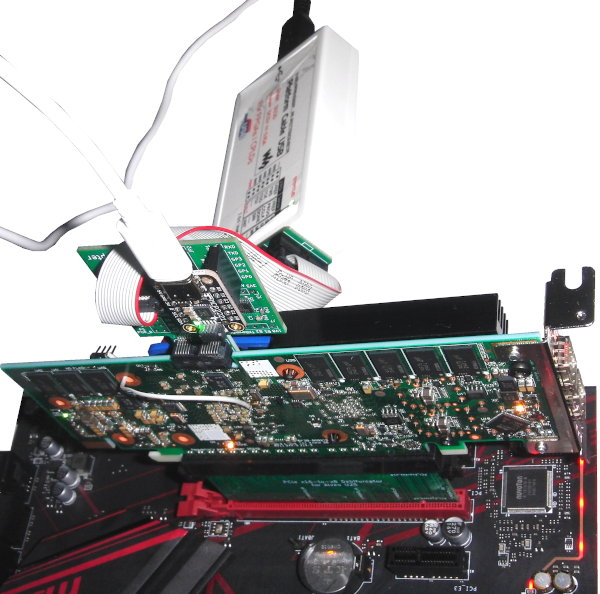


## Set Up CentOS System

Install all software packages you will need. This is from a listing of all installed packages on the system I am using for testing.
```
yum install    abattis-cantarell-fonts abrt abrt-addon-ccpp \
  abrt-addon-kerneloops abrt-addon-pstoreoops abrt-addon-python \
  abrt-addon-vmcore abrt-addon-xorg abrt-cli abrt-console-notification \
  abrt-dbus abrt-desktop abrt-gui abrt-gui-libs abrt-libs abrt-python \
  abrt-retrace-client abrt-tui accountsservice accountsservice-libs acl \
  adcli adobe-mappings-cmap adobe-mappings-cmap-deprecated \
  adobe-mappings-pdf adwaita-cursor-theme adwaita-gtk2-theme \
  adwaita-icon-theme aic94xx-firmware alsa-firmware alsa-lib \
  alsa-plugins-pulseaudio alsa-tools-firmware alsa-utils anaconda \
  anaconda-core anaconda-gui anaconda-tui anaconda-widgets appstream-data \
  apr apr-util armadillo-devel at atk atkmm at-spi2-atk at-spi2-core attica \
  attr audit audit-libs audit-libs-python augeas-libs authconfig autoconf \
  autocorr-en autofs autogen-libopts automake avahi avahi-glib avahi-gobject \
  avahi-libs avahi-ui-gtk3 avr-gcc-c++ avr-libc baobab basesystem bash \
  bash-completion bc bind-export-libs bind-libs bind-libs-lite bind-license \
  bind-utils binutils biosdevname bison bison-devel bison-runtime bleachbit \
  blktrace bluez bluez-libs bolt boost boost169-atomic boost169-build \
  boost169-chrono boost169-container boost169-context boost169-contract \
  boost169-coroutine boost169-date-time boost169-devel boost169-doc \
  boost169-doctools boost169-examples boost169-fiber boost169-filesystem \
  boost169-graph boost169-graph-mpich boost169-graph-openmpi \
  boost169-iostreams boost169-jam boost169-locale boost169-log boost169-math \
  boost169-mpich boost169-mpich-devel boost169-mpich-python2 \
  boost169-mpich-python2-devel boost169-mpich-python3 \
  boost169-mpich-python3-devel boost169-numpy2 boost169-numpy3 \
  boost169-openmpi boost169-openmpi-devel boost169-openmpi-python2 \
  boost169-openmpi-python2-devel boost169-openmpi-python3 \
  boost169-openmpi-python3-devel boost169-program-options boost169-python2 \
  boost169-python2-devel boost169-python3 boost169-python3-devel \
  boost169-random boost169-regex boost169-serialization boost169-stacktrace \
  boost169-static boost169-system boost169-test boost169-thread \
  boost169-timer boost169-type_erasure boost169-wave boost-date-time \
  boost-devel boost-filesystem boost-iostreams boost-program-options \
  boost-python boost-python36-devel boost-python36-static boost-random \
  boost-signals boost-system boost-thread brasero brasero-libs \
  brasero-nautilus bridge-utils brlapi brltty btrfs-progs byacc bzip2 \
  bzip2-devel bzip2-libs ca-certificates cairo cairo-devel cairo-gobject \
  cairomm c-ares cdbs cdparanoia cdparanoia-libs cdrdao celt051 \
  centos-indexhtml centos-logos centos-release certmonger cgdcbxd checkpolicy \
  cheese cheese-libs chkconfig chrony chrpath cifs-utils cjkuni-uming-fonts \
  clang clang-devel clinfo clucene-contribs-lib clucene-core clutter \
  clutter-gst2 clutter-gst3 clutter-gtk cmake cogl colord colord-gtk \
  colordiff colord-libs color-filesystem compat-cheese314 compat-db47 \
  compat-db-headers compat-exiv2-026 compat-glibc compat-glibc-headers \
  compat-gnome-desktop314 compat-libcap1 compat-libcogl12 \
  compat-libcogl-pango12 compat-libcolord1 compat-libf2c-34 \
  compat-libgfortran-41 compat-libtiff3 compat-openldap conda control-center \
  control-center-filesystem copy-jdk-configs coreutils cpio cpp cppcheck \
  cppcheck-gui cppcheck-htmlreport cracklib cracklib-dicts crash crda \
  createrepo cronie cronie-anacron crontabs cross-gcc-common cryptopp \
  cryptopp-devel cryptopp-progs crypto-utils cryptsetup cryptsetup-libs \
  cryptsetup-python cscope csmock-plugin-cppcheck ctags CUnit cups \
  cups-client cups-filesystem cups-filters cups-filters-libs cups-libs \
  cups-pk-helper curl cyrus-sasl cyrus-sasl-gssapi cyrus-sasl-lib \
  cyrus-sasl-md5 cyrus-sasl-plain cyrus-sasl-scram daxctl-libs dbus \
  dbus-glib dbus-libs dbusmenu-qt dbus-python dbus-x11 dconf debconf \
  debhelper debootstrap dejavu-fonts-common dejavu-sans-fonts \
  dejavu-sans-mono-fonts dejavu-serif-fonts deltarpm desktop-file-utils \
  device-mapper device-mapper-event device-mapper-event-libs \
  device-mapper-libs device-mapper-multipath device-mapper-multipath-libs \
  device-mapper-persistent-data devmem2 dh-autoreconf dhclient dhcp-common \
  dhcp-libs diffstat diffutils dkms dleyna-connector-dbus dleyna-core \
  dleyna-server dmidecode dmraid dmraid-events dnsmasq docbook-dtds \
  docbook-style-xsl dos2unix dosfstools dotconf doxygen dpdk dpdk-devel \
  dpkg dpkg-dev dpkg-perl dracut dracut-config-rescue dracut-network dtc \
  dvd+rw-tools dwz dyninst e2fsprogs e2fsprogs-libs ebtables ed efibootmgr \
  efivar-libs ekiga elfutils elfutils-default-yama-scope elfutils-devel \
  elfutils-libelf elfutils-libelf-devel elfutils-libelf-devel-static \
  elfutils-libs emacs-filesystem empathy enchant enscript eog epel-release \
  espeak ethtool evince evince-libs evince-nautilus evolution \
  evolution-data-server evolution-data-server-langpacks evolution-ews \
  evolution-ews-langpacks evolution-help evolution-langpacks evolution-mapi \
  evolution-mapi-langpacks exempi exiv2 exiv2-libs expat expat-devel \
  expat-static farstream farstream02 fastestmirror, fcoe-utils festival \
  festival-freebsoft-utils festival-lib festival-speechtools-libs \
  festvox-slt-arctic-hts fftw-libs-double file file-libs file-roller \
  file-roller-nautilus filesystem findutils fio fipscheck fipscheck-lib \
  firefox firewall-config firewalld firewalld-filesystem firstboot \
  flac-libs flashrom flatpak flatpak-libs flex flex-devel flite folks \
  fontconfig fontconfig-devel fontpackages-filesystem fprintd fprintd-pam \
  freeglut freerdp-libs freetype freetype-devel frei0r-plugins fribidi \
  fribidi-devel fros fuse fuse-encfs fuse-libs fwupd fwupdate-efi \
  fwupdate-libs fxload gamin gavl gawk gcc gcc-c++ gcc-c++-arm-linux-gnu \
  gcc-c++-microblaze-linux-gnu gcc-gfortran gcc-microblaze-linux-gnu \
  gcc-objc gcc-objc++ gcc-x86_64-linux-gnu GConf2 gcr gd gdb gdbm gdbm-devel \
  gdisk gdk-pixbuf2 gdm gedit genisoimage geoclue2 geoclue2-libs \
  geocode-glib GeoIP geoipupdate gettext gettext-common-devel gettext-devel \
  gettext-libs gflags gflags-devel ghc-aeson ghc-array ghc-attoparsec \
  ghc-base ghc-base64-bytestring ghc-base-unicode-symbols ghc-binary \
  ghc-blaze-builder ghc-blaze-html ghc-blaze-markup ghc-bytestring \
  ghc-conduit ghc-containers ghc-data-default ghc-deepseq ghc-digest \
  ghc-directory ghc-dlist ghc-extensible-exceptions ghc-filepath \
  ghc-hashable ghc-highlighting-kate ghc-hslua ghc-HTTP ghc-lifted-base \
  ghc-monad-control ghc-mtl ghc-network ghc-old-locale ghc-old-time \
  ghc-pandoc ghc-pandoc-types ghc-parsec ghc-pcre-light ghc-pretty \
  ghc-primitive ghc-process ghc-random ghc-resourcet ghc-semigroups ghc-syb \
  ghc-tagsoup ghc-template-haskell ghc-temporary ghc-texmath ghc-text \
  ghc-time ghc-transformers ghc-transformers-base ghc-unix \
  ghc-unordered-containers ghc-utf8-string ghc-vector ghc-void ghc-xml \
  ghc-yaml ghc-zip-archive ghc-zlib ghostscript ghostscript-cups \
  ghostscript-fonts giflib giflib-devel giflib-utils git gjs glade-libs \
  glib glib2 glibc glibc-common glibc-devel glibc-headers glibmm24 \
  glib-networking glog glusterfs glusterfs-api glusterfs-cli \
  glusterfs-client-xlators glusterfs-fuse glusterfs-libs glx-utils gmock gmp \
  gmp-devel gnome-abrt gnome-bluetooth gnome-bluetooth-libs gnome-boxes \
  gnome-calculator gnome-classic-session gnome-clocks gnome-color-manager \
  gnome-contacts gnome-desktop3 gnome-dictionary gnome-disk-utility \
  gnome-documents gnome-documents-libs gnome-font-viewer \
  gnome-getting-started-docs gnome-icon-theme gnome-icon-theme-extras \
  gnome-icon-theme-symbolic gnome-initial-setup gnome-keyring \
  gnome-keyring-pam gnome-menus gnome-online-accounts gnome-online-miners \
  gnome-packagekit gnome-packagekit-common gnome-packagekit-installer \
  gnome-packagekit-updater gnome-screenshot gnome-session \
  gnome-session-xsession gnome-settings-daemon gnome-shell \
  gnome-shell-extension-alternate-tab gnome-shell-extension-apps-menu \
  gnome-shell-extension-common gnome-shell-extension-horizontal-workspaces \
  gnome-shell-extension-launch-new-instance \
  gnome-shell-extension-places-menu gnome-shell-extension-top-icons \
  gnome-shell-extension-user-theme gnome-shell-extension-window-list \
  gnome-software gnome-system-log gnome-system-monitor gnome-terminal \
  gnome-terminal-nautilus gnome-themes-standard gnome-tweak-tool \
  gnome-user-docs gnome-video-effects gnome-weather gnu-free-fonts-common \
  gnu-free-mono-fonts gnu-free-sans-fonts gnu-free-serif-fonts gnupg2 gnutls \
  gnutls-c++ gnutls-utils gobject-introspection gom \
  google-crosextra-caladea-fonts google-crosextra-carlito-fonts google-gson \
  google-noto-emoji-color-fonts gperftools-libs gpgme gpm-libs graphite2 \
  graphite2-devel graphviz graphviz-devel graphviz-gd grep grilo \
  grilo-plugins groff-base grub2 grub2-common grub2-efi-x64 grub2-pc \
  grub2-pc-modules grub2-tools grub2-tools-extra grub2-tools-minimal grubby \
  gsettings-desktop-schemas gsm gsound gspell gssdp gssproxy gstreamer \
  gstreamer1 gstreamer1-plugins-bad-free gstreamer1-plugins-bad-free-gtk \
  gstreamer1-plugins-base gstreamer1-plugins-good \
  gstreamer1-plugins-ugly-free gstreamer-devel gstreamer-plugins-bad-free \
  gstreamer-plugins-base gstreamer-plugins-base-devel \
  gstreamer-plugins-base-tools gstreamer-plugins-good gstreamer-python \
  gstreamer-python-devel gstreamer-tools gtk2 gtk2-devel gtk2-immodule-xim \
  gtk3 gtk3-immodule-xim gtkmm24 gtkmm30 gtksourceview3 gtkspell3 \
  gtk-update-icon-cache gtk-vnc2 gtkwave gucharmap gucharmap-libs gupnp \
  gupnp-av gupnp-dlna gupnp-igd gutenprint gutenprint-cups gvfs gvfs-afc \
  gvfs-afp gvfs-archive gvfs-client gvfs-fuse gvfs-goa gvfs-gphoto2 gvfs-mtp \
  gvfs-smb gvnc gzip h5py hardlink harfbuzz harfbuzz-devel harfbuzz-icu hdf5 \
  hdf5-devel hesiod hicolor-icon-theme highlight hostname hpijs hplip-common \
  hplip-libs htop http-parser hunspell hunspell-en hunspell-en-GB \
  hunspell-en-US hwdata hyperv-daemons hyperv-daemons-license hypervfcopyd \
  hypervkvpd hypervvssd hyphen hyphen-en ibacm ibus ibus-chewing ibus-gtk2 \
  ibus-gtk3 ibus-hangul ibus-kkc ibus-libpinyin ibus-libs ibus-m17n \
  ibus-rawcode ibus-sayura ibus-setup ibus-table ibus-table-chinese icat \
  icedax icedtea-web icu ilmbase imsettings imsettings-gsettings \
  imsettings-libs indent infiniband-diags infiniband-diags-devel info \
  initial-setup initial-setup-gui initscripts Installed intel-cmt-cat \
  intel-cmt-cat-devel intltool ipa-client ipa-client-common ipa-common \
  iproute iprutils ipset ipset-libs iptables iputils ipxe-roms-qemu \
  irqbalance iscsi-initiator-utils iscsi-initiator-utils-iscsiuio iso-codes \
  isomd5sum ivtv-firmware iw iwl1000-firmware iwl100-firmware iwl105-firmware \
  iwl135-firmware iwl2000-firmware iwl2030-firmware iwl3160-firmware \
  iwl3945-firmware iwl4965-firmware iwl5000-firmware iwl5150-firmware \
  iwl6000-firmware iwl6000g2a-firmware iwl6000g2b-firmware iwl6050-firmware \
  iwl7260-firmware jansson jasper jasper-libs java-1 java-11-openjdk \
  java-11-openjdk-devel java-11-openjdk-headless java-11-openjdk-jmods \
  javapackages-tools jbigkit-libs jimtcl jline jomolhari-fonts jpeginfo \
  jpegoptim json-c json-c-devel jsoncpp jsoncpp-devel json-glib Judy \
  kate-part kbd kbd-legacy kbd-misc kde-filesystem kdelibs kdelibs-common \
  kdelibs-ktexteditor kdesdk-common kdesdk-kcachegrind kde-settings kernel \
  kernel-devel kernel-headers kernel-module-sfc-RHEL7-3 kernel-tools \
  kernel-tools-libs kernel-tools-libs-devel kexec-tools keybinder3 keyutils \
  keyutils-libs keyutils-libs-devel khmeros-base-fonts khmeros-fonts-common \
  kmod kmod-libs konsole kpartx kpatch krb5-devel krb5-libs krb5-workstation \
  lame langpacks langtable langtable-data langtable-python lapack64 \
  lapack64-devel lapack64-static lapack-devel lapack-static lcms2 ldns ledmon \
  less leveldb leveldb-devel libabw libacl libaio libaio-devel libao \
  libappstream-glib libarchive libassuan libasyncns libatasmart libattr \
  libavc1394 libbasicobjects libblkid libblkid-devel libblockdev \
  libblockdev-crypto libblockdev-fs libblockdev-loop libblockdev-mdraid \
  libblockdev-nvdimm libblockdev-part libblockdev-swap libblockdev-utils \
  libbluray libburn libbytesize libcacard libcanberra libcanberra-gtk2 \
  libcanberra-gtk3 libcap libcap-devel libcap-ng libcdio libcdio-paranoia \
  libcdr libcgroup libcgroup-tools libchamplain libchamplain-gtk libchewing \
  libcmis libcollection libcom_err libcom_err-devel libconfig libconfuse \
  libcroco libcryptui libcurl libcurl-devel libdaemon libdb libdb-devel \
  libdb-utils libdhash libdmapsharing libdmx libdnet libdrm libdrm-devel \
  libdv libdvdnav libdvdread libdwarf libedit libedit-devel libepoxy \
  liberation-fonts-common liberation-mono-fonts liberation-sans-fonts \
  liberation-serif-fonts libestr libetonyek libevdev libevent libexif \
  libexttextcat libfastjson libfdt libfdt-devel libffi libffi-devel \
  libfontenc libfprint libfreehand libftdi libftdi-devel libfullock libgcab1 \
  libgcc libgcrypt libgdata libgdither libgee libgee06 libgepub libgexiv2 \
  libgfortran libgfortran4 libgfortran5 libgfortran-static libglade2 libGLEW \
  libglvnd libglvnd-egl libglvnd-gles libglvnd-glx libgnomekbd \
  libgnome-keyring libgomp libgovirt libgpg-error libgphoto2 libgpod libgs \
  libgsf libgtop2 libgudev1 libgusb libgweather libgxps libhangul libibumad \
  libibverbs libical libICE libicu libidn libiec61883 libieee1284 \
  libimobiledevice libini_config libinput libiodbc libipa_hbac libiptcdata \
  libiscsi libisofs libjpeg-turbo libjpeg-turbo-devel libkadm5 libkkc \
  libkkc-common libkkc-data liblangtag libldb liblouis liblouis-python \
  libmarkdown libmbim libmbim-utils libmediaart libmediainfo libmfx \
  libmfx-devel libmng libmnl libmnl-devel libmodman libmount libmount-devel \
  libmpc libmpcdec libmpc-devel libmspack libmspub libmtp libmusicbrainz5 \
  libmwaw libmx libndp libnetfilter_conntrack libnfnetlink libnfsidmap \
  libnice libnl libnl3 libnl3-cli libnma libnm-gtk libnotify liboauth \
  libodfgen libofa libogg liborcus libosinfo libpagemaker libpaper \
  libpath_utils libpcap libpcap-devel libpciaccess libpeas libpeas-gtk \
  libpeas-loader-python libpinyin libpinyin-data libpipeline libplist \
  libpmem libpmemblk libpng libpng12 libpng12-devel libpng-devel libproxy \
  libproxy-mozjs libpurple libpwquality libqmi libqmi-utils libquadmath \
  libquadmath-devel librados2 LibRaw libraw1394 librbd1 librdmacm \
  libref_array libreoffice-calc libreoffice-core libreoffice-data \
  libreoffice-draw libreoffice-emailmerge libreoffice-graphicfilter \
  libreoffice-gtk2 libreoffice-gtk3 libreoffice-impress libreofficekit \
  libreoffice-langpack-en libreoffice-math libreoffice-opensymbol-fonts \
  libreoffice-pdfimport libreoffice-pyuno libreoffice-ure \
  libreoffice-ure-common libreoffice-writer libreoffice-x11 libreport \
  libreport-anaconda libreport-centos libreport-cli libreport-filesystem \
  libreport-gtk libreport-plugin-bugzilla libreport-plugin-mailx \
  libreport-plugin-mantisbt libreport-plugin-reportuploader \
  libreport-plugin-rhtsupport libreport-plugin-ureport libreport-python \
  libreport-rhel-anaconda-bugzilla libreport-web libreswan librevenge \
  librsvg2 libsamplerate libsane-hpaio libseccomp libsecret libselinux \
  libselinux-devel libselinux-python libselinux-utils libsemanage \
  libsemanage-python libsepol libsepol-devel libshout libsigc++20 libSM \
  libsmartcols libsmbclient libsmbios libsndfile libsodium libsodium13 \
  libsodium-devel libsoup libspectre libsrtp libss libssh libssh2 \
  libssh2-devel libssh-devel libsss_autofs libsss_certmap libsss_idmap \
  libsss_nss_idmap libsss_sudo libstaroffice libstdc++ libstdc++-devel \
  libstoragemgmt libstoragemgmt-python libstoragemgmt-python-clibs \
  libsysfs libtalloc libtar libtasn1 libtdb libteam libtevent libtheora \
  libtiff libtiff-devel libtimezonemap libtirpc libtool libtool-ltdl \
  libudisks2 libunistring libunwind libunwind-devel libusal libusb \
  libusb-devel libusbmuxd libusbx libusbx-devel libuser libuser-python \
  libutempter libuuid libuuid-devel libv4l libva libverto libverto-devel \
  libverto-tevent libvirt-daemon libvirt-daemon-config-network \
  libvirt-daemon-driver-interface libvirt-daemon-driver-network \
  libvirt-daemon-driver-nodedev libvirt-daemon-driver-nwfilter \
  libvirt-daemon-driver-qemu libvirt-daemon-driver-secret \
  libvirt-daemon-driver-storage libvirt-daemon-driver-storage-core \
  libvirt-daemon-driver-storage-disk libvirt-daemon-driver-storage-gluster \
  libvirt-daemon-driver-storage-iscsi libvirt-daemon-driver-storage-logical \
  libvirt-daemon-driver-storage-mpath libvirt-daemon-driver-storage-rbd \
  libvirt-daemon-driver-storage-scsi libvirt-daemon-kvm libvirt-gconfig \
  libvirt-glib libvirt-gobject libvirt-libs libvisio libvisual libvma \
  libvma-devel libvorbis libvpx libwacom libwacom-data libwayland-client \
  libwayland-cursor libwayland-egl libwayland-server libwbclient libwebp \
  libwebp-devel libwebp-tools libwinpr libwnck3 libwpd libwpg libwps \
  libwvstreams libX11 libX11-common libX11-devel libXau libXau-devel libXaw \
  libxcb libxcb-devel libXcomposite libXcursor libXdamage libXdmcp libXext \
  libXfixes libXfont libXfont2 libXft libXft-devel libXi libXinerama \
  libxkbcommon libxkbcommon-x11 libxkbfile libxklavier libxml++ libxml2 \
  libxml2-python libXmu libXp libXpm libXpm-devel libXrandr libXrender \
  libXrender-devel libXres libXScrnSaver libxshmfence libxslt libXt libXtst \
  libXv libXvMC libXxf86dga libXxf86misc libXxf86vm libyaml libzapojit libzip \
  libzmf libzstd linux-firmware lklug-fonts lksctp-tools lldpad llvm \
  llvm-devel llvm-libs llvm-private lmdb lm_sensors-libs Loaded lockdev \
  logrotate lohit-assamese-fonts lohit-bengali-fonts lohit-devanagari-fonts \
  lohit-gujarati-fonts lohit-kannada-fonts lohit-malayalam-fonts \
  lohit-marathi-fonts lohit-nepali-fonts lohit-oriya-fonts \
  lohit-punjabi-fonts lohit-tamil-fonts lohit-telugu-fonts lpsolve lrzsz \
  lsof lsscsi lua lvm2 lvm2-libs lz4 lzo lzop m17n-contrib m17n-db m17n-lib \
  m4 madan-fonts mailcap mailx make makeself man-db man-pages \
  man-pages-overrides mariadb-libs marisa mdadm meanwhile media-player-info \
  meld mesa-dri-drivers mesa-filesystem mesa-libEGL mesa-libgbm mesa-libGL \
  mesa-libglapi mesa-libGLES mesa-libGLU mesa-libxatracker mesa-private-llvm \
  meson metacity microcode_ctl minicom mlocate mobile-broadband-provider-info \
  mock ModemManager ModemManager-glib mokutil motif mousetweaks \
  mozilla-filesystem mozjs17 mozjs24 mozjs52 mpfr mpg123-libs mtdev mtools \
  mtr mutter mythes mythes-en nano nasm nautilus nautilus-extensions \
  nautilus-sendto ncompress ncurses ncurses-base ncurses-devel ncurses-libs \
  ndctl ndctl-libs neon netcf-libs net-snmp-libs nettle nettle-devel \
  net-tools NetworkManager NetworkManager-adsl NetworkManager-bluetooth \
  NetworkManager-glib NetworkManager-libnm NetworkManager-libreswan \
  NetworkManager-libreswan-gnome NetworkManager-ppp NetworkManager-team \
  NetworkManager-tui NetworkManager-wifi NetworkManager-wwan newt newt-python \
  nfs4-acl-tools nfs-utils nhn-nanum-fonts-common nhn-nanum-gothic-fonts \
  ninja-build nmap nmap-ncat nm-connection-editor nspr nss nss-pem \
  nss-softokn nss-softokn-freebl nss-sysinit nss-tools nss-util ntp \
  ntpdate ntsysv numactl-libs numad numpy numpy-f2py nvme-cli ocl-icd \
  ocl-icd-devel oddjob oddjob-mkhomedir okular okular-devel okular-libs opal \
  openblas openblas-devel opencc openchange opencl-headers opencv opencv-core \
  opencv-devel opencv-python OpenEXR-libs OpenImageIO-devel openjpeg2 \
  openjpeg-devel openjpeg-libs openldap openocd open-sans-fonts openscap \
  openscap-scanner opensm opensm-devel opensm-libs openssh openssh-clients \
  openssh-server openssl openssl098e openssl-devel openssl-libs open-vm-tools \
  open-vm-tools-desktop opus opus-devel opusfile opus-tools orc orca \
  osinfo-db osinfo-db-tools os-prober overpass-fonts p11-kit p11-kit-trust \
  p7zip PackageKit PackageKit-command-not-found PackageKit-glib \
  PackageKit-gstreamer-plugin PackageKit-gtk3-module PackageKit-yum Packages \
  pakchois paktype-naskh-basic-fonts pam pandoc pango pango-devel pangomm \
  paps paps-libs paratype-pt-sans-fonts parted passwd patch patchutils \
  pciutils pciutils-devel pciutils-libs pcre pcre2 pcre-devel pcsc-lite-libs \
  perftest perl perl-autodie perl-Business-ISBN perl-Business-ISBN-Data \
  perl-Carp perl-CGI perl-Compress-Raw-Bzip2 perl-Compress-Raw-Zlib \
  perl-constant perl-Convert-BinHex perl-Data-Dumper perl-Data-OptList \
  perl-devel perl-Devel-GlobalDestruction perl-Digest perl-Digest-HMAC \
  perl-Digest-MD5 perl-Digest-SHA perl-Digest-SHA1 perl-Digest-SHA3 \
  perl-Email-Date-Format perl-Email-Simple perl-Encode perl-Encode-Locale \
  perl-Error perl-Exporter perl-ExtUtils-Install perl-ExtUtils-MakeMaker \
  perl-ExtUtils-Manifest perl-ExtUtils-ParseXS perl-FCGI perl-File-FcntlLock \
  perl-File-Listing perl-File-Path perl-File-Remove perl-File-Temp \
  perl-Filter perl-Font-AFM perl-Font-TTF perl-Getopt-Long perl-gettext \
  perl-Git perl-HTML-Format perl-HTML-Parser perl-HTML-Tagset perl-HTML-Tree \
  perl-HTTP-Cookies perl-HTTP-Daemon perl-HTTP-Date perl-HTTP-Message \
  perl-HTTP-Negotiate perl-HTTP-Tiny perl-Image-ExifTool perl-IO-Compress \
  perl-IO-HTML perl-IO-Socket-IP perl-IO-Socket-SSL perl-IO-String \
  perl-IO-stringy perl-libs perl-libwww-perl perl-LWP-MediaTypes perl-macros \
  perl-Mail-Box perl-Mail-IMAPClient perl-Mail-Sendmail perl-MailTools \
  perl-Mail-Transport-Dbx perl-MIME-Lite perl-MIME-tools perl-MIME-Types \
  perl-Mozilla-CA perl-Net-HTTP perl-Net-LibIDN perl-Net-SMTP-SSL \
  perl-Net-SSLeay perl-Object-Realize-Later perl-Package-Generator \
  perl-Params-Util perl-parent perl-Parse-RecDescent perl-PathTools \
  perl-Pod-Escapes perl-podlators perl-Pod-Perldoc perl-Pod-Simple \
  perl-Pod-Usage perl-Regexp-Assemble perl-Scalar-List-Utils perl-Socket \
  perl-srpm-macros perl-Storable perl-Sub-Exporter \
  perl-Sub-Exporter-Progressive perl-Sub-Install perl-TermReadKey \
  perl-Test-Harness perl-TeX-Hyphen perl-Text-Autoformat perl-Text-CharWidth \
  perl-Text-Iconv perl-Text-ParseWords perl-Text-Reform perl-Text-WrapI18N \
  perl-Thread-Queue perl-threads perl-threads-shared perl-TimeDate \
  perl-Time-HiRes perl-Time-Local perl-Time-Piece perl-URI perl-User-Identity \
  perl-WWW-RobotRules perl-XML-Parser pexpect phonon phonon-backend-gstreamer \
  php-cli php-common picosat picosat-devel pinentry pinentry-gtk pinfo pixman \
  pixman-devel pkgconfig plugins: plymouth plymouth-core-libs \
  plymouth-graphics-libs plymouth-plugin-label plymouth-plugin-two-step \
  plymouth-scripts plymouth-system-theme plymouth-theme-charge pm-utils \
  pnm2ppa po-debconf policycoreutils policycoreutils-python polkit \
  polkit-pkla-compat polkit-qt poppler poppler-data poppler-glib \
  poppler-utils popt postfix ppp procmail procps-ng procps-ng-devel \
  protobuf protobuf-c protobuf-c-devel protobuf-python psacct psmisc pth \
  ptlib pulseaudio pulseaudio-gdm-hooks pulseaudio-libs \
  pulseaudio-libs-glib2 pulseaudio-module-bluetooth pulseaudio-module-x11 \
  pulseaudio-utils putty pycairo pygobject2 pygpgme pygtk2 pygtk2-devel \
  pygtk2-libglade pykickstart pyldb pyliblzma pyOpenSSL pyparsing pyparted \
  PyQt4 PyQt4-devel pytalloc pytest python python2-absl-py python2-attrs \
  python2-blockdev python2-crypto python2-cryptography python2-cytoolz \
  python2-futures python2-gflags python2-graphitesend python2-ipaclient \
  python2-ipalib python2-jsonpickle python2-jsonschema python2-jupyroot \
  python2-jupyter-core python2-leveldb python2-llfuse python2-lmdb \
  python2-matplotlib python2-nbformat python2-numpy python2-olefile \
  python2-parso python2-pyasn1 python2-pyasn1-modules python2-pyatspi \
  python2-pycosat python2-pydot python2-pygraphviz python2-pyrsistent \
  python2-pysocks python2-pytest-runner python2-rpm-macros \
  python2-scikit-image python2-subprocess32 python2-toolz python2-wcwidth \
  python3 python36-absl-py python36-asn1crypto python36-attrs \
  python36-backports_abc python36-brotli python36-cairo python36-cairo-devel \
  python36-cffi python36-conda python36-crypto python36-cryptography \
  python36-cytoolz python36-decorator python36-docutils python36-flask \
  python36-idna python36-importlib-metadata python36-importlib-resources \
  python36-jinja2 python36-jsonpickle python36-jsonschema python36-jupyroot \
  python36-jupyter-core python36-leveldb python36-llfuse python36-lxml \
  python36-m2crypto python36-markdown python36-markupsafe python36-nbformat \
  python36-numpy python36-olefile python36-parso python36-pillow python36-ply \
  python36-pyasn1 python36-pyasn1-modules python36-pycosat python36-pycparser \
  python36-pydot python36-pygments python36-pygraphviz python36-pyqt4-sip \
  python36-pyrsistent python36-pysocks python36-pytest-runner python36-scapy \
  python36-six python36-sphinx python36-terminado python36-toolz \
  python36-virtualenv python36-wcwidth python36-werkzeug python36-zipp \
  python3-html2text python3-libs python3-pip python3-service-identity \
  python3-setuptools python3-sphinx python3-sphinx-common python-augeas \
  python-backports python-backports-ssl_match_hostname python-bleach \
  python-blivet python-brlapi python-carbon python-cffi python-chardet \
  python-configobj python-configshell python-coverage python-cups \
  python-dateutil python-decorator python-deltarpm python-devel python-di \
  python-dmidecode python-dns python-enum34 python-ethtool python-firewall \
  python-gmpy2 python-gobject python-gobject-base python-gssapi python-idna \
  python-iniparse python-inotify python-ipaddress python-IPy python-ipython \
  python-javapackages python-jinja2 python-jupyter-core-doc python-jwcrypto \
  python-kitchen python-kmod python-ldap python-libipa_hbac python-libs \
  python-linux-procfs python-lxml python-markupsafe python-marshmallow \
  python-matplotlib python-matplotlib-qt4 python-matplotlib-tk python-meh \
  python-meh-gui python-mistune python-netaddr python-netifaces \
  python-networkx python-nss python-ntplib python-OpenImageIO python-pandas \
  python-perf python-pillow python-ply python-progressbar python-pwquality \
  python-pyblock python-pybloomfiltermmap python-pycparser python-pycurl \
  python-pygments python-pyudev python-qrcode-core python-requests \
  python-rpm-macros python-rtslib python-schedutils python-setuptools \
  python-six python-slip python-slip-dbus python-smbc python-srpm-macros \
  python-sssdconfig python-sss-murmur python-tdb python-urlgrabber \
  python-urllib3 python-urwid python-virtualenv python-werkzeug python-yubico \
  pytz pyusb pyxattr PyYAML qca2 qemu-common qemu-guest-agent qemu-img \
  qemu-kvm qemu-kvm-common qemu-system-x86 qodem qpdf-libs qrencode-libs \
  qscintilla-python qscintilla-python-devel qt qterminal qtermwidget \
  qt-settings qt-x11 quilt quota quota-nls radvd raptor2 rarian rarian-compat \
  rasqal rcs rdate rdma-core rdma-core-devel readline readline-devel realmd \
  redhat-lsb-core redhat-lsb-submod-security redhat-menus redhat-rpm-config \
  redland redland-virtuoso rest rfkill rhino rhythmbox rng-tools rootfiles \
  rpcbind rpm rpm-build rpm-build-libs rpm-libs rpm-python rpm-sign rsync \
  rsyslog rtkit sakura samba-client samba-client-libs samba-common \
  samba-common-libs samba-libs sane-backends sane-backends-drivers-scanners \
  sane-backends-libs satyr sbc scalapack-common scap-security-guide \
  scikit-image-tools scipy scl-utils screen SDL sdparm seabios-bin seahorse \
  seavgabios-bin sed selinux-policy selinux-policy-targeted setools-libs \
  setroubleshoot setroubleshoot-plugins setroubleshoot-server setserial setup \
  setuptool sfutils sg3_utils sg3_utils-devel sg3_utils-libs sgabios-bin \
  sgml-common sgpio shadow-utils shared-desktop-ontologies shared-mime-info \
  shim-x64 shotwell sil-abyssinica-fonts sil-nuosu-fonts sil-padauk-fonts \
  sip skkdic slang smartmontools smc-fonts-common smc-meera-fonts snappy \
  sockperf soprano sos sound-theme-freedesktop soundtouch sox spax \
  speech-dispatcher speech-dispatcher-python speex spice-glib spice-gtk3 \
  spice-server spice-vdagent sqlite sqlite2 squashfs-tools squashfuse \
  squashfuse-devel squashfuse-libs sssd sssd-ad sssd-client sssd-common \
  sssd-common-pac sssd-ipa sssd-krb5 sssd-krb5-common sssd-ldap sssd-proxy \
  startup-notification stix-fonts strace strigi-libs strongswan subversion \
  subversion-libs sudo sushi swig sysstat system-config-printer \
  system-config-printer-libs system-config-printer-udev systemd systemd-devel \
  systemd-libs systemd-python systemd-sysv systemtap systemtap-client \
  systemtap-devel systemtap-runtime systemtap-sdt-devel sysvinit-tools \
  taglib tagsoup tar targetcli tcl tcl-devel tcl-tclreadline-devel tcpdump \
  tcp_wrappers tcp_wrappers-libs tcsh teamd telepathy-farstream \
  telepathy-filesystem telepathy-gabble telepathy-glib telepathy-haze \
  telepathy-logger telepathy-mission-control telepathy-salut tigervnc-license \
  tigervnc-server-minimal time tio tk tk-devel tmux totem totem-nautilus \
  totem-pl-parser traceroute tracker tree trousers ttmkfdir tuned tzdata \
  tzdata-java uboot-images-armv7 uboot-images-armv8 uboot-tools \
  ucs-miscfixed-fonts udisks2 unbound-libs unoconv unzip upower \
  urw-base35-bookman-fonts urw-base35-c059-fonts urw-base35-d050000l-fonts \
  urw-base35-fonts urw-base35-fonts-common urw-base35-gothic-fonts \
  urw-base35-nimbus-mono-ps-fonts urw-base35-nimbus-roman-fonts \
  urw-base35-nimbus-sans-fonts urw-base35-p052-fonts \
  urw-base35-standard-symbols-ps-fonts urw-base35-z003-fonts usb_modeswitch \
  usb_modeswitch-data usbmuxd usbredir usbutils usermode ustr util-linux \
  uucp valgrind valgrind-devel vim vim-common vim-enhanced vim-filesystem \
  vim-minimal vinagre vino virt-what vlgothic-fonts volume_key-libs \
  vorbis-tools vte291 vte3 vte-profile vtun wavpack webkitgtk3 webkitgtk4 \
  webkitgtk4-jsc webrtc-audio-processing wget which wodim words \
  wpa_supplicant wqy-microhei-fonts wqy-zenhei-fonts wvdial wxGTK-devel \
  xcb-util xdg-desktop-portal xdg-desktop-portal-gtk xdg-user-dirs \
  xdg-user-dirs-gtk xdg-utils xfsdump xfsprogs xkeyboard-config xml-common \
  xmlrpc-c xmlrpc-c-client xmlsec1 xmlsec1-openssl xorg-x11-apps \
  xorg-x11-drivers xorg-x11-drv-ati xorg-x11-drv-dummy xorg-x11-drv-evdev \
  xorg-x11-drv-fbdev xorg-x11-drv-intel xorg-x11-drv-nouveau xorg-x11-drv-qxl \
  xorg-x11-drv-synaptics xorg-x11-drv-v4l xorg-x11-drv-vesa \
  xorg-x11-drv-vmmouse xorg-x11-drv-vmware xorg-x11-drv-void \
  xorg-x11-drv-wacom xorg-x11-fonts-100dpi xorg-x11-fonts-ISO8859-1-100dpi \
  xorg-x11-fonts-misc xorg-x11-fonts-Type1 xorg-x11-font-utils \
  xorg-x11-proto-devel xorg-x11-server-common xorg-x11-server-utils \
  xorg-x11-server-Xorg xorg-x11-utils xorg-x11-xauth xorg-x11-xbitmaps \
  xorg-x11-xinit xorg-x11-xkb-utils xrt xterm xvattr xz xz-devel xz-libs \
  xz-lzma-compat yajl yaml-cpp yelp yelp-libs yelp-xsl yum yum-langpacks \
  yum-metadata-parser yum-plugin-fastestmirror yum-utils zenity zeromq zip \
  zlib zlib-devel zstd

```

Reboot then install all U25-related software and utilities:
```
cd ~
mkdir u25
cd u25
wget https://download.lenovo.com/servers/mig/2020/12/23/43128/xlnx-lnvgy_utl_nic_u25-2.8.372_linux_x86-64.tgz
tar -xzvf xlnx-lnvgy_utl_nic_u25-2.8.372_linux_x86-64.tgz
cp ./xlnx-lnvgy_utl_nic_u25-2.8.372_linux_x86-64/* .
rm -R xlnx-lnvgy_utl_nic_u25-2.8.372_linux_x86-64

yum localinstall xrt_202020.2.8.372_7.4.1708-x86_64-xrt.rpm
yum localinstall xilinx-cmc-u25-2.1.2-2955241.noarch.rpm
yum localinstall xilinx-u25-gen3x8-xdma-validate-1-2954712.noarch.rpm
yum localinstall xilinx-u25-gen3x8-xdma-base-1-2953517.noarch.rpm 


cd ~/u25/
wget https://download.lenovo.com/servers/mig/2020/12/23/43129/xlnx-lnvgy_dd_nic_u25-4.15.10.1003_linux_x86-64.tgz
tar -xzvf xlnx-lnvgy_dd_nic_u25-4.15.10.1003_linux_x86-64.tgz
cp ./xlnx-lnvgy_dd_nic_u25-4.15.10.1003_linux_x86-64/* .
rm -R xlnx-lnvgy_dd_nic_u25-4.15.10.1003_linux_x86-64/
rpmbuild --rebuild sfc-4.15.10.1003-1.src.rpm 
rpm -ivh /root/rpmbuild/RPMS/x86_64/kernel-module-sfc-RHEL7-3.10.0-1160.88.1.el7.x86_64-4.15.10.1003-1.x86_64.rpm 
modprobe sfc
lsmod | grep sfc


wget https://download.lenovo.com/servers/mig/2021/01/06/43174/xlnx-lnvgy_fw_nic_u25-8.1.3.1011-1_linux_x86-64.tgz
tar -xzvf xlnx-lnvgy_fw_nic_u25-8.1.3.1011-1_linux_x86-64.tgz
cp ./xlnx-lnvgy_fw_nic_u25-8.1.3.1011-1_linux_x86-64/* .
rm -R xlnx-lnvgy_fw_nic_u25-8.1.3.1011-1_linux_x86-64/
yum localinstall sfutils-8.1.3.1011-1.x86_64.rpm
```

Choose the correct version of Java to be the default.
```
sudo alternatives --config java
```


## Program Configuration FLASH Memory

Load your Vivado or Vivado Lab `settings64.sh` and start `xsdb`. The `after 6000` command waits 6 seconds for [Xilinx-Compatible JTAG adapters](https://docs.xilinx.com/r/en-US/ug908-vivado-programming-debugging/JTAG-Cables-and-Devices-Supported-by-hw_server) based on the [FX2](https://www.infineon.com/cms/en/product/universal-serial-bus/usb-2.0-peripheral-controllers/ez-usb-fx2lp-fx2g2-usb-2.0-peripheral-controller/) to update their firmware and needs to be run once after every time the adapter is powered.
```
source /tools/Xilinx/Vivado/2021.1/settings64.sh
xsdb
```

The following prepares the XCZU19EG for Flash programming:
```
connect
after 6000
targets
targets -set -nocase -filter {name =~ "*PSU*"}
mwr 0xff5e0200 0x0100
rst -system
after 1000
targets -set -nocase -filter {name =~ "*APU*"}
mwr 0xffff0000 0x14000000
mask_write 0xFD1A0104 0x501 0x0
targets -set -nocase -filter {name =~ "*A53*#0"}
stop
targets
disconnect
exit
```

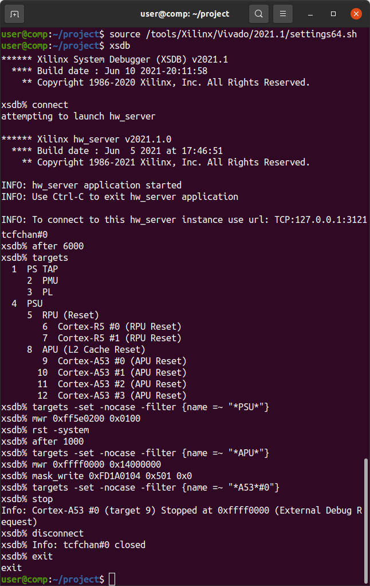

Program the QSPI Flash:
```
program_flash -f BOOT.BIN -offset 0 -flash_type qspi-x4-single -fsbl fsbl.elf -cable type xilinx_tcf url TCP:127.0.0.1:3121
```

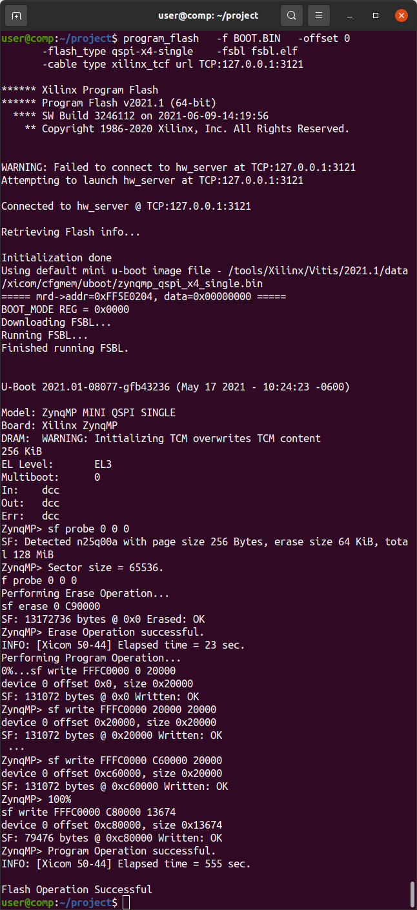


## JTAG Using UrJTAG

[UrJTAG](http://urjtag.org) is a low-level tool for communicating with JTAG devices. It supports [Xilinx Platform Cable USB II](https://docs.xilinx.com/v/u/en-US/ds593) adapters and [clones](https://www.waveshare.com/platform-cable-usb.htm). Main use is *EXTEST* pin toggling although it is theoretically possible to program the FPGA using an [SVF file generated from the Vivado Tcl Console](https://docs.xilinx.com/r/2021.2-English/ug908-vivado-programming-debugging/Using-the-Command-Line?tocId=L2PEfMkFFNtSZI~r7QbNVg).


### Compile and Install UrJTAG

```Shell
cd ~
wget https://downloads.sourceforge.net/project/urjtag/urjtag/2021.03/urjtag-2021.03.tar.xz
sha256sum urjtag-2021.03.tar.xz
echo b0a2eaa245513af096dc4d770109832335c694c6c12aa5e92fefae8685416f1c should be the SHA256 Checksum
tar -xvf urjtag-2021.03.tar.xz
cd urjtag-2021.03/
./configure
make
sudo make install
sudo ldconfig
```


### Create UrJTAG-Compatible JTAG Definition Files from BSDL Files

Xilinx's [Zynq Ultrascale+ BSDL Files](https://www.xilinx.com/member/forms/download/sim-model-eval-license-xef.html?filename=bsdl_zynquplus_2021_2.zip) include `STD_1149_6_2003.all` definitions that UrJTAG's `bsdl2jtag` cannot process and must therefore be removed. The included [xczu19eg_ffvc1760.jtag](xczu19eg_ffvc1760.jtag) and [zynqu_arm_dap.jtag](zynqu_arm_dap.jtag) files are processed and tested to work with UrJTAG.


### Add XCZU19EG FFVC1760 JTAG Bit Definitions to UrJTAG

From the directory containing the `.jtag` files run the following commands which create *PART* and *STEPPINGS* files for the XCZU19EG. These commands assume UrJTAG installed support files to the default `/usr/local/share/` directory. Values were found by running the UrJTAG `detect` command which reads the `Device Id` from the JTAG chain. First 4 bits (`0001`) are the *STEPPING*, next 16 bits (`0100011101011000`) are the *PART*, last 12 bits (`01000111011`) are the *MANUFACTURER*.
```Shell
sudo su
echo "# Zynq Ultrascale+ (XCZUxxEG)" >>/usr/local/share/urjtag/xilinx/PARTS
echo -e "0100011101011000\txczu19eg_1760\txczu19eg_ffvc1760" >>/usr/local/share/urjtag/xilinx/PARTS
mkdir /usr/local/share/urjtag/xilinx/xczu19eg_1760
touch /usr/local/share/urjtag/xilinx/xczu19eg_1760/STEPPINGS
echo "0001 xczu19eg_1760 1" >>/usr/local/share/urjtag/xilinx/xczu19eg_1760/STEPPINGS
echo "0000 xczu19eg_1760 0" >>/usr/local/share/urjtag/xilinx/xczu19eg_1760/STEPPINGS
cp xczu19eg_ffvc1760.jtag /usr/local/share/urjtag/xilinx/xczu19eg_1760/xczu19eg_1760
echo -e "01000111011\tarm\t\tARM"  >>/usr/local/share/urjtag/MANUFACTURERS
mkdir /usr/local/share/urjtag/arm
touch /usr/local/share/urjtag/arm/PARTS
echo -e "1011101000000000\tzynqu_arm_dap\tzynqu_arm_dap" >>/usr/local/share/urjtag/arm/PARTS
mkdir /usr/local/share/urjtag/arm/zynqu_arm_dap
touch /usr/local/share/urjtag/arm/zynqu_arm_dap/STEPPINGS
echo "0101 zynqu_arm_dap 5" >>/usr/local/share/urjtag/arm/zynqu_arm_dap/STEPPINGS
cp zynqu_arm_dap.jtag /usr/local/share/urjtag/arm/zynqu_arm_dap/zynqu_arm_dap
exit
```

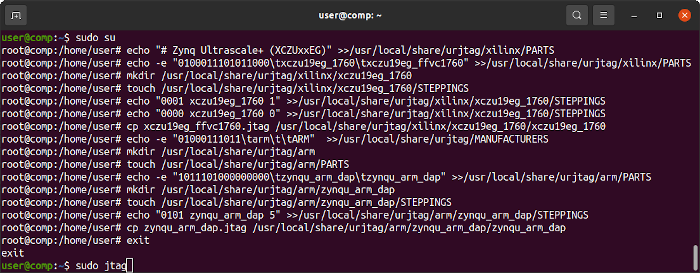


#### Connect JTAG Adapter and Allow Vivado to Update Platform Cable USB II Firmware

Connect your JTAG Adapter to the Alveo U25 using the [Alveo U25 JTAG Adapter](https://github.com/mwrnd/AlveoU25_JTAG_Adapter). The Alveo needs to be powered over its PCIe connection.

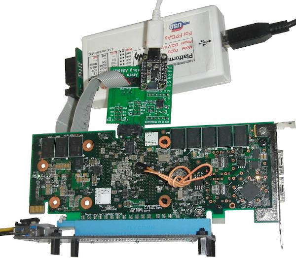

If you are using a Platform Cable USB II compatible adapter it will show up under `lsusb` as `03fd:0013 Xilinx, Inc.` In this state it _CANNOT_ be used for JTAG.

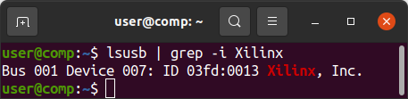

Run Xilinx's `xsdb` which comes with Vivado:
```
source /tools/Xilinx/Vivado/2021.2/settings64.sh
xsdb
```

In `xsdb` run the following commands to bring the Zynq out of the `L2 Cache Reset` state and into the `Power On Reset` and `External Debug Request` state. The 10 second delay (`after 10000`) allows for Xilinx's `hw_server` to update the Platform Cable II Firmware in the background.
```
connect
after 10000
targets
targets -set -nocase -filter {name =~ "*APU*"}
mwr 0xffff0000 0x14000000
mask_write 0xFD1A0104 0x501 0x0
targets -set -nocase -filter {name =~ "*A53*#0"}
stop
targets
```

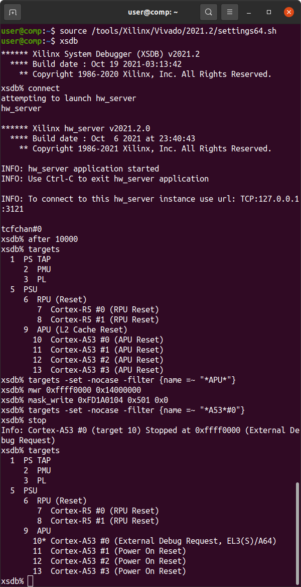

`exit` from `xsdb`. `lsusb` should now show `03fd:0008 Xilinx, Inc. Platform Cable USB II`. The JTAG adapter is ready to be used by UrJTAG.

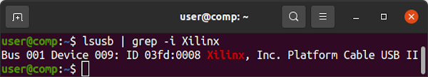


#### Begin a UrJTAG Session

`sudo jtag` to start UrJTAG with access to USB. You should see the `jtag> ` command prompt. A [JTAG Overview](https://www.xjtag.com/about-jtag/jtag-a-technical-overview/) may be helpful before you begin. Note that `shift ir` and `shift dr` need to be run to change the debug target's state. Running `instruction` commands only changes UrJTAG's internal state.

Valid signal names can be found in the [xczu19eg_ffvc1760.jtag](xczu19eg_ffvc1760.jtag) file.

`cable xpc_ext` selects the Xilinx Platform Cable II, external JTAG chain

`detect` finds all devices in the JTAG chain

`print chain` prints all devices in the JTAG chain

`part 1` selects the Zynq for JTAG communication. Good practise to always make this explicit.

`instruction EXTEST` select the External Test Function

`shift ir` shifts EXTEST into the JTAG Instruction Register to put the device into EXTEST mode

`shift dr` shifts the Data Register containing all pin states into UrJTAG memory

`dr` prints the full contents of the JTAG Data Register.

It is more useful to read individual signals:

`get signal PS_MODE0` displays the value of pin PS_MODE0(AA27)

`get signal PS_MODE1` displays the value of pin PS_MODE1(AC28)

`get signal PS_MODE2` displays the value of pin PS_MODE2(AA28)

`get signal PS_MODE3` displays the value of pin PS_MODE3(AB28)

The above MODE pins define Quad-SPI as the [Boot Mode](https://docs.xilinx.com/r/en-US/ug1085-zynq-ultrascale-trm/Boot-Modes).

`get signal PS_ERROR_OUT` indicates a Power, Hardware, or PMU Exception when =1.

`get signal PS_INIT_B` indicates a CRC Error in the PL Bitstream when =1.

`get signal PS_ERROR_STATUS` indicates a lockdown state or PMU Status Error when =1.

`get signal PS_DONE` indicates PL Configuration completed when =1.

`reset` resets the JTAG chain and enters Bypass Mode

`quit` exits UrJTAG

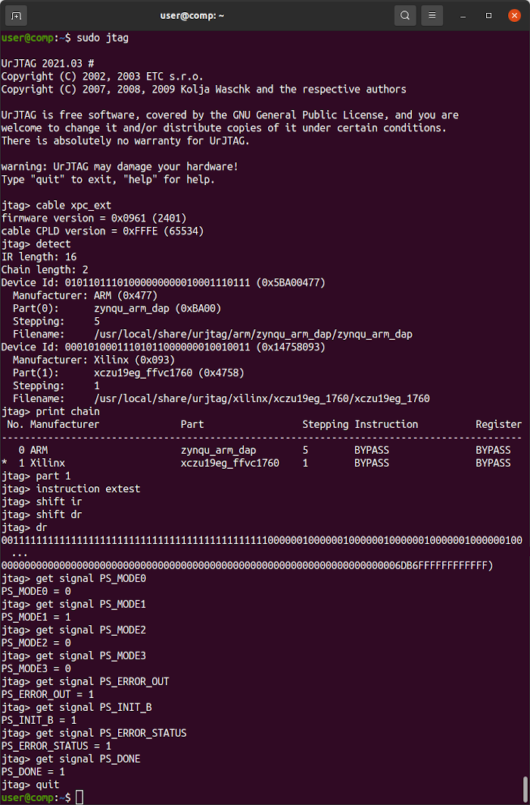


The included UrJTAG scripts [`getallio`](getallio) and [`getallpsmio`](getallpsmio) will return the states of all the Programmable Logic (PL) I/O pins and Processing System (PS) Multiplexed I/O pins, respectively.
```
include /DOWNLOAD_DIRECTORY/getallio
```

A sequence of instructions like the following can be used to set IO pins. Be careful which signals you set. They should be wired appropriately on the board. Refer to [xczu19eg_ffvc1760.jtag](xczu19eg_ffvc1760.jtag) for signal names.

```
instruction SAMPLE/PRELOAD
shift ir
shift dr
get signal IO_??

instruction EXTEST
shift ir
set signal IO_?? out 0
shift dr

instruction SAMPLE/PRELOAD
shift ir
shift dr
get signal IO_??

instruction EXTEST
shift ir
set signal IO_?? in
shift dr

instruction SAMPLE/PRELOAD
shift ir
shift dr
get signal IO_??
```


## Reading Back the Zynq Configuration Memory

In the Vivado Tcl Console, run:
```
readback_hw_device [current_hw_device]  -readback_file zu19eg_u25_r.rbd  -bin_file zu19eg_u25_b.bin
```

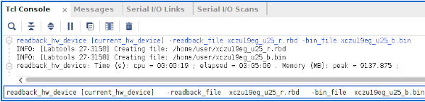


## Miscallaneous Notes

[XCU25==XCZU19EG-FFVC1760](https://en.wikipedia.org/w/index.php?title=List_of_Xilinx_FPGAs&oldid=1129244401) Banks from [Zynq Ultrascale+ Device Packaging and Pinouts](https://docs.xilinx.com/v/u/en-US/ug1075-zynq-ultrascale-pkg-pinout).

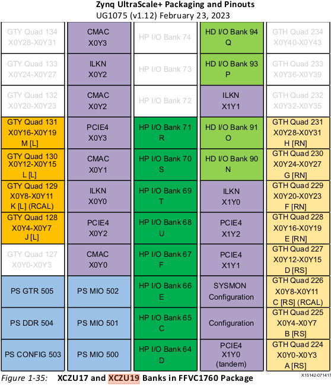


## Useful Links

[Zynq Ultrascale+ MPSoC Overview](https://docs.xilinx.com/v/u/en-US/ds891-zynq-ultrascale-plus-overview)

[Zynq Ultrascale+ MPSoC Design Hub](https://xilinx.com/support/documentation-navigation/design-hubs/dh0070-zynq-mpsoc-design-overview-hub.html)

[Zynq Ultrascale+ Technical Reference Manual](https://docs.xilinx.com/r/en-US/ug1085-zynq-ultrascale-trm)

[Zynq Ultrascale+ Device Packaging and Pinouts](https://docs.xilinx.com/v/u/en-US/ug1075-zynq-ultrascale-pkg-pinout)

[Zynq Ultrascale+ MPSoC Datasheet](https://www.xilinx.com/content/dam/xilinx/support/documents/data_sheets/ds925-zynq-ultrascale-plus.pdf)

[Zynq UltraScale+ Devices Register Reference](https://docs.xilinx.com/r/en-US/ug1087-zynq-ultrascale-registers/Overview)([HTML](https://www.xilinx.com/htmldocs/registers/ug1087/ug1087-zynq-ultrascale-registers.html)) is [Downloadable](https://www.xilinx.com/html_docs/registers/ug1087/ug1087-zynq-ultrascale-registers.zip)

[ServeTheHome Forum](https://forums.servethehome.com/index.php?threads/identifying-some-curious-xilinx-solarflare-cards.35111) post about the Alveo U25

[Zynq Boot Process Overview](https://docs.xilinx.com/r/en-US/ug1137-zynq-ultrascale-mpsoc-swdev/Boot-Process-Overview)

[JTAG Boot Image Format](https://docs.xilinx.com/r/en-US/ug1085-zynq-ultrascale-trm/Boot-Image-Format)

[Bare Metal Application Development](https://docs.xilinx.com/r/2021.1-English/ug1137-zynq-ultrascale-mpsoc-swdev/Bare-Metal-Application-Development)

[XRT Documentation](https://xilinx.github.io/XRT/2020.2/html/platforms_partitions.html#single-stage-platforms)

[XRT Dual-Stage Platform](https://xilinx.github.io/XRT/master/html/platforms_partitions.html#two-stage-platforms) - U25 shell stage is included in the [U25 FPGA Utility](https://support.lenovo.com/us/en/downloads/ds547996-xilinx-u25-fpga-utility-for-unknown-os) ([2.8.372](https://download.lenovo.com/servers/mig/2020/12/23/43128/xlnx-lnvgy_utl_nic_u25-2.8.372_linux_x86-64.tgz)) package. Base stage is not public.

[Flashing Shell to U25N](https://xilinx.github.io/U25N-SmartNIC-Solution/docs/build/html/docs/ug1534-shellprogramming.html)

[Flashing Shell to U25 Support Forum Post](https://support.xilinx.com/s/question/0D52E00006hpYjRSAU/flashing-shell-to-u25?language=en_US)

[Alveo Platform Partitions](https://xilinx.github.io/XRT/master/html/platforms_partitions.html)

[Alveo U25 Member Page](https://www.xilinx.com/member/u25.html)

[U25 Xilinx Lenovo Page](https://www.xilinx.com/products/boards-and-kits/alveo/oem-partner/lenovo-servers.html) has a [Production Package](https://www.xilinx.com/content/dam/xilinx/publications/products/board-kits/u25_production_package_nov20.zip) and a [Utilities Package](https://www.xilinx.com/content/dam/xilinx/support/download/lenovo/xn-200528-ls-3-x2522-25g-u25-lenovo-linux-utilities-rpm-64-bit.zip)

[U25 X2 NIC Driver](https://support.lenovo.com/us/en/downloads/ds547997-xilinx-u25-x2-nic-driver-for-unknown-os) ([4.15.10.1003](https://download.lenovo.com/servers/mig/2020/12/23/43129/xlnx-lnvgy_dd_nic_u25-4.15.10.1003_linux_x86-64.tgz))

[U25 X2 NIC Firmware](https://support.lenovo.com/us/en/downloads/ds548057-xilinx-u25-x2-nic-firmware-for-unknown-os) ([8.1.3.1011-1](https://download.lenovo.com/servers/mig/2021/01/06/43174/xlnx-lnvgy_fw_nic_u25-8.1.3.1011-1_linux_x86-64.tgz))

[U25 FPGA Utility](https://support.lenovo.com/us/en/downloads/ds547996-xilinx-u25-fpga-utility-for-unknown-os) ([2.8.372](https://download.lenovo.com/servers/mig/2020/12/23/43128/xlnx-lnvgy_utl_nic_u25-2.8.372_linux_x86-64.tgz))

[U25 Cloud Instance](https://vmaccel.com/xilinxtrial/)

[Alveo U25 Product Brief](https://www.xilinx.com/content/dam/xilinx/publications/product-briefs/alveo-u25-product-brief.pdf)

[Alveo U25N Product Brief](https://www.xilinx.com/content/dam/xilinx/publications/product-briefs/xilinx-u25N-product-brief.pdf) is almost identical but lacks the FPGA to PCIe connections.

[U25N Install Notes](https://xilinx.github.io/U25N-SmartNIC-Solution/docs/build/html/docs/ug1534-installation.html)

[MT40A512M16LY-062E](https://media-www.micron.com/-/media/client/global/documents/products/data-sheet/dram/ddr4/8gb_ddr4_sdram.pdf)([D9WFJ FBGA Code](https://www.micron.com/support/tools-and-utilities/fbga?fbga=D9WFJ#pnlFBGA)) is the DDR4 memory IC used on the U25.

[MT25QU01](https://media-www.micron.com/-/media/client/global/documents/products/data-sheet/nor-flash/serial-nor/mt25q/die-rev-b/mt25q_qlkt_u_01g_bbb_0.pdf)([RW188 FBGA Code](https://www.micron.com/support/tools-and-utilities/fbga?fbga=RW188#pnlFBGA)) is the QSPI Configuration Memory flash IC used on the U25.


